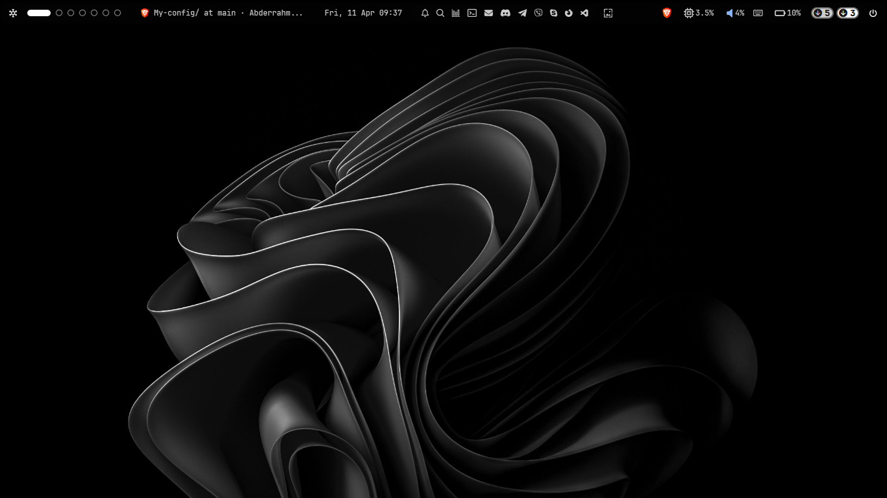
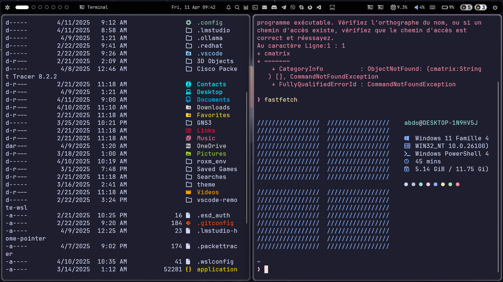

# 🖥️ System Configuration Files  

  

This repository stores configuration files for various system tools and utilities, ensuring a consistent setup across environments.  

## 📸 Screenshots  

| Tool Preview | Description |  
|--------------|-------------|  
|  | `fastfetch` in action |  
|  | Custom Oh My Posh prompt |  

*(Replace placeholder links with actual screenshots)*  

## 📁 Contents  

| Tool        | Latest Update          | Badges |  
|-------------|------------------------|--------|  
| `fastfetch` | First commit (18m ago) |  |  
| `ohmyposh`  | First commit (18m ago) |  |  
| `yash`      | Updated (2m ago)       |  |  

*(Add badges from [sh
