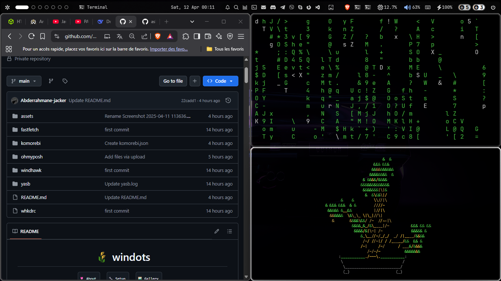
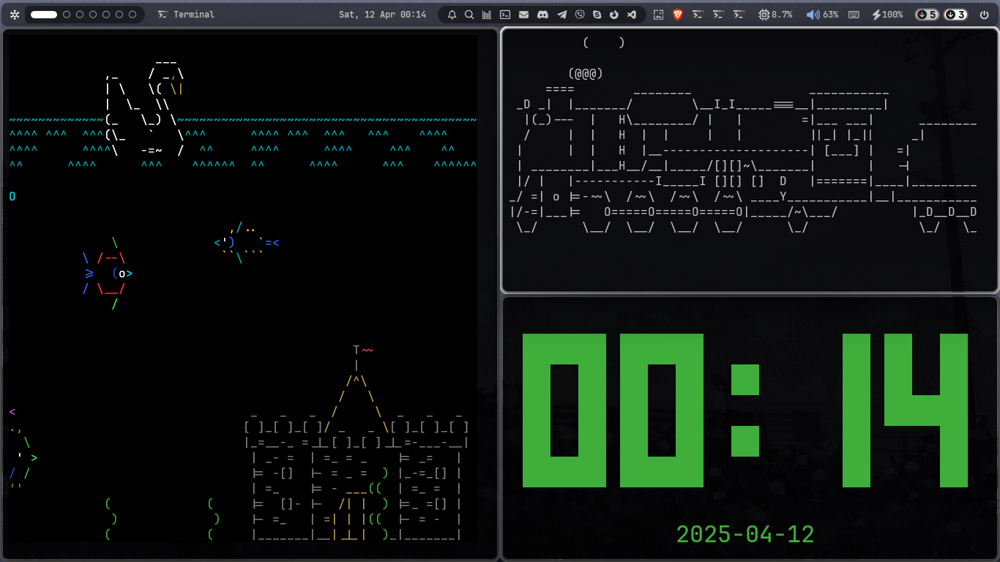

<h1 align="center">🌾 windots</h1>

<div align="center">
  <a href="#about"><kbd> <br> 🌷 About <br> </kbd></a>&ensp;&ensp;
  <a href="#setup"><kbd> <br> 🔧 Setup <br> </kbd></a>&ensp;&ensp;
  <a href="#gallery"><kbd> <br> 🖼️ Gallery <br> </kbd></a>&ensp;&ensp;
</div>

<br>

<br/><br/>
<br/><br/>
<br/><br/>
<br/><br/>


<h2 id="about">🌷 About</h2>

🌟 Windows Ricing Toolkit
"Transforming your Windows into a Unix-like paradise, one dotfile at a time"

Terminal Showcase
Your future terminal - sleek, powerful, and distinctly not-stock

🎯 What's This?
A battle-tested collection of dotfiles and configurations to help you:

✨ Achieve that perfect riced look you've been drooling over on r/unixporn

⚡ Boost your productivity with Unix-like workflows on Windows

🛠️ Escape the default Windows terminal/UI monotony


## 🔧 Featured Tools

| Tool | Badge | Description | Key Feature | Install |
|------|-------|-------------|-------------|---------|
| **[YASB](https://github.com/denBot/yasb)** <br>❄️ |   | Beautiful browser startpage with widgets | Live weather, search, bookmarks | `git clone https://github.com/denBot/yasb.git` |
| **[Oh My Posh](https://ohmyposh.dev/)** <br>🨠|   | Ultimate terminal prompt engine | Real-time git status, icons | `winget install oh-my-posh` |
| **[komorebi](https://github.com/LGUG2Z/komorebi)** <br>🪟 |  | Tiling WM for Windows | i3-like keybindings | `scoop install komorebi` |
| **[fastfetch](https://github.com/fastfetch-cli/fastfetch)** <br>⚙️ |  | System info tool | Minimalist, themable | `winget install fastfetch` |
| **[Flow Launcher](https://www.flowlauncher.com/)** <br>🚀 |  | App launcher | Alfred alternative | `scoop install flow-launcher` |

## 🔧 Key Features Table

| Feature          | fastfetch | Oh My Posh | Yasb | whkd |
|------------------|-----------|------------|------|------|
| Windows Support  | ✅        | ✅         | ✅   | ✅   |
| Linux Support    | ✅        | ✅         | ✅   | ❌   |
| Custom Themes    | ✅        | ✅         | ✅   | ✅   |
| Performance      | ⚡ Blazing fast | 🚀 Quick | 🐢 Moderate | ⚡ Instant |


> [!NOTE]
> All configs related to my **Linux setup (WSL2)** are maintained in this repository: [**dotfiles**](https://github.com/ashish0kumar/dotfiles)

## ✨ Features

- 🪟 **** komorebic config
- ❄️ Beautiful **YASB** config
- \>_ Sleek **windows terminal** config
- 🐚 **Powershell** config
- 🎨 **Ohmyposh** theme
- ⚙️ Minimal **fastfetch** config
- 🚀 **Flow launcher** config
- 🦅 Themeable **Start menu, Taskbar and Notification center**

<hr/>

## 🎮 Ricing Components


| Component | Emoji | Description | 
|-----------|-------|-------------|
| **[komorebic](https://github.com/LGUG2Z/komorebi)** | 🪟 | Tiling window manager for Windows (like i3 for Linux) | 
| **[YASB](https://github.com/denBot/yasb)** | ❄️ | Yet Another Startpage - Beautiful browser homepage | 
| **Windows Terminal** | >_ | Fully customized terminal experience |
| **PowerShell** | 🐚 | Optimized shell configuration with aliases | 
| **Oh My Posh** | 🎨 | Custom prompt theme with git status | 
| **fastfetch** | ⚙️ | Minimal system info display | 
| **Flow Launcher** | 🚀 | Spotlight-style app launcher | 
| **Win11 Visuals** | 🦅 | Themed Start/Taskbar/Notification Center | 

You can find other links above in <b>🔧 Key Features Table</b>
<hr/>

### ℹ️ Whole System Info
"I used to hate Windows. Now I just hate other people's Windows setups."

Here is all the information about my setup:


#### 🪟 System

| 📚 Entry                           	 | ✨ App                  |
|----------------------------------------|--------------------------|
| **OS** 				 | [Windows 11](https://www.microsoft.com/en-in/windows/windows-11) |
| **Window Manager** 			 |  [Komorebic](https://github.com/LGUG2Z/komorebi) [⚙️](https://github.com/Abderrahmane-jacker/My-config/tree/main/komorebi) |
| **Bar** 				 |  [YASB](https://github.com/amnweb/yasb) [⚙️]((https://github.com/Abderrahmane-jacker/My-config/tree/main/yasb)) |
| **Application Launcher** 		 | [Flow Launcher](https://www.flowlauncher.com/) [⚙️](https://github.com/Abderrahmane-jacker/My-config/tree/main/FlowLauncher) |
| **Mods** 				 |  [Windhawk](https://windhawk.net/) [⚙️](https://github.com/Abderrahmane-jacker/My-config/tree/main/windhawk) |

#### 🖥️ CLI/TUI Apps (Configs for these can be found in this repo: [**dotfiles**](https://github.com/ashish0kumar/dotfiles))

| 📚 Entry                           	 | ✨ App                  |
|----------------------------------------|--------------------------|
| **Shell**                              | [pwsh](https://learn.microsoft.com/en-us/powershell/module/microsoft.powershell.core/about/about_pwsh?view=powershell-7.4) [⚙️](https://github.com/Abderrahmane-jacker/My-config/tree/main/WindowsPowershell) |
| **Shell Prompt**                       | [ohmyposh](https://ohmyposh.dev/) [⚙️]
| **System Fetch**                       | [fastfetch](https://github.com/fastfetch-cli/fastfetch) [⚙️](https://github.com/Abderrahmane-jacker/My-config/tree/main/fastfetch) |
 

#### 🖱️ GUI Apps

| 📚 Entry                           	 | ✨ App                  |
|----------------------------------------|--------------------------|
| **Fallback Text Editor**               | [VSCode](https://code.visualstudio.com/) |
| **Music Player**                       |  [Spotify](https://open.spotify.com/) (patched with [Spicetify](https://spicetify.app/)) |
| **Web Browser**               	 |  [brave-Browser](https://brave.com/) |
| **Note Taking App**                    |  [notion](https://www.notion.com/) |
| **File Manager**                       | [File Explorer](https://www.microsoft.com/en-us/windows/tips/file-explorer) |
 

#### 🔍 Other

| 📚 Entry                             | ✨ App                  |
|---------------------------------------|--------------------------|
| **Font**                  		| [JetBrainsMono Nerd Font](https://www.jetbrains.com/lp/mono/) |

 

<h2 id="setup">🔧 Setup</h2>

> [!WARNING]
> Before proceeding, make sure to **backup your existing configuration files**.  
> Some settings may overwrite your current setup, so **manually merge or restore** if needed.

### 🪟 Komorebic

> [!NOTE]  
> This setup is compatible with the latest version of **komorebi** but **does not use Zebar**. Instead, it uses **YASB** for the bar.

- **Install** [**Komorebi**](https://github.com/LGUG2Z/komorebi).

- [`My-config/komorebi/komorebic.json`](./komorebi/komorebi.json) → `%USERPROFILE%\komorebi.json`

- **Restart Komorebic** for the changes to take effect.

### 📊 YASB (Yet Another Status Bar)

> [!NOTE]
> Make sure you have a Nerd Font installed for proper icon rendering. I use **JetBrainsMono Nerd Font**, so if you are using a different Nerd Font, update the fonts in the YASB `styles.css` accordingly.

- [`My-config/yasb/`](./yasb) → `%USERPROFILE%\.config\yasb\`

- **Restart YASB** for the changes to take effect.

### 🚀 Flow Launcher

- **Install** [**Flow Launcher**](https://www.flowlauncher.com/)

- [`My-config/FlowLauncher/settings.json`](./FlowLauncher/settings.json) → `%APPDATA%\FlowLauncher\Settings\Settings.json`

- **Restart Flow Launcher**

### 🦅 Windhawk

- **Install Relevant Mods** from the [Windhawk Store](https://windhawk.net/explore):
	- Notification Center Styler
	- Start Menu Styler
	- Taskbar Styler
- **Copy** the Windhawk config files from [`windhawk`](.config/windhawk/)
- Open the relevant mod’s **details page**, go to **Advanced > Mod Settings**, paste the config, and click **"Load"** to apply it.

## \>_ Terminal & Shell Setup

### 🐚 PowerShell

- [`myconfig/WindowsPowershell/Microsoft.PowerShell_profile.ps1`](./WindowsPowershell/Microsoft.PowerShell_profile.ps1) → `%USERPROFILE%\Documents\WindowsPowerShell\Microsoft.PowerShell_profile.ps1`

- Restart PowerShell to apply the changes.

### 🎨 Oh My Posh

- [`myconfig`](./ohmyposh/zen.toml) → `%USERPROFILE%\.config\ohmyposh\zen.toml`
- if you want to use my theme use [`myconfig/ohmyposh/1_shell.omp.json`](./ohmyposh/1_shell.omp.json) instead of zen.toml

- **Optional Step:** Skip this if you applied my PowerShell config.
	- I have already included the command to set the theme in the PowerShell profile, so there's no need to do it manually. The following command is automatically applied when PowerShell starts:

```bash
oh-my-posh init pwsh --config "$env:USERPROFILE\.config\ohmyposh\zen.toml" | Invoke-Expression
```

### ⚙️ Fastfetch

```bash
winget install fastfetch
```

- [`My-config/fastfetch/config.jsonc`](/fastfetch/config.jsonc) → `%USERPROFILE%\.config\fastfetch\config.conf`
- [`My-config/fastfetch/windows.txt`](/fastfetch/windows.txt) → `%USERPROFILE%\.config\fastfetch\windows.txt`

- **Run fastfetch**.

<hr/>

## ⌨️ komorebic keybindings 

You can always change these in your `whkdrc`
if you want to change komorebi behaviour change `./komorebi/komorebi.json`


| Keys                                                                   | Action                                                          |
|------------------------------------------------------------------------|-----------------------------------------------------------------|
| <kbd>alt</kbd> + <kbd>p</kbd>                                      | Open terminal                                                   |
| <kbd>alt</kbd> + <kbd>q</kbd>                                          | Close focusing window                                           |
| <kbd>alt</kbd> + <kbd>1 - 9</kbd>                                      | Focus workspace {n}                                             | 
| <kbd>alt</kbd> + <kbd>shift</kbd> + <kbd>1 - 9</kbd>                   | Move focusing window to workspace {n}                           |
| <kbd>alt</kbd> + <kbd>m</kbd>                                          | Toggle window minimization                                	   |
| <kbd>alt</kbd> + <kbd>t</kbd>                                          | Make focusing window float/tiled                                |


<hr/>


<h2 id="gallery">🖼️ ‎Gallery</h2>

> [!NOTE]
> You can check out the **wallpapers** [**here**](https://github.com/ashish0kumar/windots/tree/main/walls#readme) if you're interested!

| **Browser on brave and cmatrix, cbonsai scripts** |
|-------------------------------------------------------|
|  |

| **GUI Text Editor** |
|-------------------------------------------------------|
|  |

| **Topbar menu and TUI System Monitor** |
|-------------------------------------------------------|
|  |  |

| **Start Menu, Taskbar and Notification Center** |
|-------------------------------------------------------|
|  |

| **, tty-clock, sl and asciiquarium** |
|-------------------------------------------------------|
|  |

| **Music Player and CLI Music Visualiser** |
|-------------------------------------------------------|
|  |

| **Power Menu** |
|-------------------------------------------------------|
|  |


<hr>


<h2 id="credits">🎉 ‎Credits</h2>

- Big **thanks** to [**ashisk**](https://github.com/ashish0kumar) for inspiring me and helping me.

I wanna point out some resources that helped me the most with the setup:

- [**komorebic**](https://github.com/LGUG2Z/komorebi) for providing an incredible **tiling window manager** experience that enhances my workflow and productivity ✨
- [**YASB**](https://github.com/amnweb/yasb) for a **feature-rich and customizable status bar** that perfectly complements my setup 🚀
- [**lunar-os**](https://github.com/lunar-os/windowsdesktop2) for the **Windhawk configs** 🦅

## 📜 License
Feel free to use and modify these dotfiles to suit your needs.

<br><br>

<p align="center">
	
</p>
